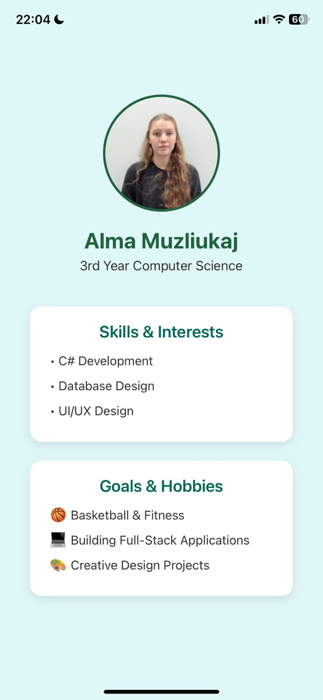

# 👩‍💻 PersonalIntroductionApp

A clean and minimal **React Native** application built using **Expo**, designed to introduce the user with a personal profile, academic background, skills, and hobbies.  
This project demonstrates the **fundamentals of React Native** — setting up an Expo project, using components, applying custom styles, and creating a responsive layout.

---

## 🧭 Table of Contents
- [Overview](#overview)
- [Screenshot](#screenshot)
- [Features](#features)
- [Technologies Used](#technologies-used)
- [Installation](#installation)
- [Running the Project](#running-the-project)
- [Author](#author)

---

## 📝 Overview

**PersonalIntroductionApp** displays your personal profile along with your skills, interests, and goals — ideal for showcasing your portfolio or learning the basics of React Native layouts and styling.

This project emphasizes:
- Component-based architecture  
- Reusable UI elements  
- StyleSheet API and Flexbox layout design  

---

## 🖼️ Screenshot

<p align="center">
  
</p>

> Screenshot of the app showing profile, skills, and hobbies.


---

## ✨ Features

- ✅ Built with **Expo CLI**
- 👤 Displays profile image, name, and academic background
- 🎯 Includes **Skills & Interests** and **Goals & Hobbies** sections
- 💅 Clean, minimal, and professional UI design
- ⚡ Supports **live reloading** using the **Expo Go** app
- 🧱 Demonstrates proper **component structure** and **Styling API**

---

## 💻 Technologies Used

| Technology | Purpose |
|-------------|----------|
| **React Native** | Frontend framework |
| **Expo CLI** | Development & build environment |
| **JavaScript (ES6+)** | App logic |
| **StyleSheet API** | Styling components |

---

## ⚙️ Installation

Follow these steps to set up and run the project locally:

```bash
# 1️⃣ Clone the repository from GitHub
git clone https://github.com/yourusername/PersonalIntroductionApp.git

# 2️⃣ Navigate into the project directory
cd PersonalIntroductionApp

# 3️⃣ Install all dependencies
npm install
```
> 🧩 **Note:** Make sure you have **Node.js (v18 or above)** and **npm** or **yarn** installed on your system.

If you don’t have **Expo CLI** installed, run the following command globally:
```bash
npm install -g expo-cli
```

--- ## 🚀 Running the Project
Once all dependencies are installed, start the development server using:
```bash
npx expo start
```

From there, you can:

- 📱 **Scan the QR code** using the **Expo Go** app (available on both Android & iOS)

- 🖥️ Or choose one of the following options directly in the terminal or browser:
  - Press **`a`** → Run on Android device/emulator  
  - Press **`i`** → Run on iOS simulator *(Mac only)*  
  - Press **`w`** → Run in your web browser  

> 💡 **Tip:** Expo Go provides instant reloading — any saved code changes will automatically appear in your app in real time.

---

## 👩‍💻 Author

**Alma Muzliukaj**  
💼 *Computer Science Student*  
🌐 [https://github.com/almamuzliukaj](https://github.com/almamuzliukaj)  
📧 [almamuzliukaj@gmail.com](mailto:almamuzliukaj@gmail.com)

---
